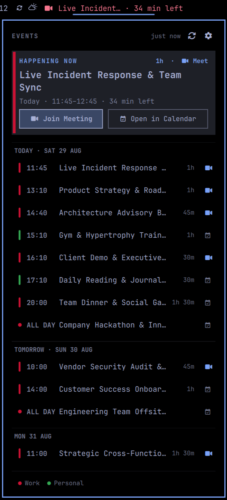
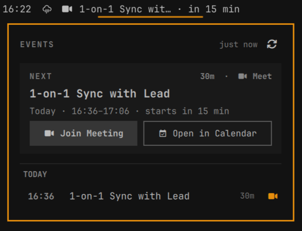
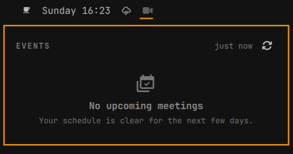

# NextEvent

Next event, right in the bar — native to your Omarchy shell. Shows the next
upcoming event from your calendar with live countdowns and lets you join Google Meet calls with a single click.

<p align="center">
  
  <br>
  <em>Active meeting with live countdown in bar, hero card with Google Meet action, and multi-day agenda (shown in Matte Black theme)</em>
</p>

## Screenshots

| Pre-Meeting / Upcoming | Setup & Onboarding Guide |
| :---: | :---: |
| <br><sub><b>Pre-meeting state</b> with <code>NEXT</code> badge & countdown</sub> | <br><sub><b>Onboarding guide</b> with OAuth & iCal options</sub> |

| Empty Schedule State | Full Multi-Day Agenda |
| :---: | :---: |
| <br><sub><b>Zero-state</b> when your schedule is clear</sub> | <br><sub><b>Grouped agenda</b> across today, tomorrow, and future days</sub> |

## Features

- **Theme Aware**: Fully syncs with your active Omarchy theme (colors, typography, borders, and corner rounding adapt automatically)
- **Google Workspace OAuth & iCal Support**: Connect corporate Google Workspace accounts without needing private iCal links, or use standard `.ics` feeds from personal Google Calendar, Microsoft Outlook, Apple iCloud, Nextcloud, and Proton
- **Bar Widget**: Shows the next event with live countdown (`Daily in 15 min`, `Daily · 15 min left`, `Daily · 14:00`, `Daily · Tmrw 14:00`, `Daily · Wed 14:00`)
- **Quick Join**: Click to open the agenda panel; single click on "Join Meeting" opens the Google Meet link in your default browser
- **Instant Actions**: Right-click on the bar widget to join the next meeting immediately; middle-click to force-refresh
- **Repeating Events**: Automatically expands repeating events (daily standups, weekly meetings) and respects cancelled or rescheduled instances
- **Live Updates**: Automatic background sync every few minutes, with a 30-second reactive countdown timer

## Install

```sh
omarchy plugin add https://github.com/tobiasz-p/next-event.git --enable
```

Or manually: copy this folder into `~/.config/omarchy/plugins/tobiasz-p.next-event` and run

```sh
omarchy plugin enable tobiasz-p.next-event
```

## Remove

```sh
omarchy plugin remove tobiasz-p.next-event
```

---

## Setup & Calendar Connection

NextEvent supports two calendar sources:

### Option 1: Google Workspace OAuth (Recommended for Work Accounts)

In many Google Workspace organizations, administrators disable the "Secret address in iCal format" / private ICS sharing for security policies. NextEvent includes guided OAuth onboarding:

```sh
~/.config/omarchy/plugins/tobiasz-p.next-event/sync/setup
```

#### Why bring your own OAuth credentials?
`calendar.readonly` is a Google *sensitive scope*. Distributing a shared client ID would require Google verification and is capped at 100 test users with 7-day token expiration. By creating your own personal Google Cloud project and Desktop OAuth Client:
- You own the app credentials directly.
- Refresh tokens work indefinitely without expiring every 7 days.
- Workspace domain policies that block public/secret `.ics` feeds are bypassed safely.

The setup script automates GCP project creation, Google Calendar API enablement, the OAuth login, and installs a systemd user timer to automatically sync events into `~/.local/state/omarchy/calendar-events.json` every 5 minutes.

---

### Option 2: Private iCal (.ics) Feed URL (Personal Accounts)

For personal accounts (Google Calendar, Outlook, iCloud, Nextcloud, Fastmail):

```sh
omarchy bar set tobiasz-p.next-event icsUrl '<your-private-ics-url>'
```

#### Google Calendar Personal Account Example:
1. Open Google Calendar → Settings → the calendar you want → "Integrate calendar"
2. Copy the "Secret address in iCal format" URL
3. Set it on the widget:

```sh
omarchy bar set tobiasz-p.next-event icsUrl 'https://calendar.google.com/calendar/ical/xxxxx/private-xxxxxxxx/basic.ics'
```

---

## Available Settings

Configure settings with `omarchy bar set tobiasz-p.next-event <key> <value>`:

| Key                      | Default                                                     | Description                                                                                                            |
| ------------------------ | ----------------------------------------------------------- | ---------------------------------------------------------------------------------------------------------------------- |
| `icsUrl`                 | `""`                                                        | Private iCal feed URL (if left empty, NextEvent reads from the JSON state file)                                       |
| `eventsJsonPath`         | `~/.local/state/omarchy/calendar-events.json`               | Path to the JSON events state file (written by `sync/setup`, `omarchy-calendar`, or any custom script)                 |
| `refreshMinutes`         | `5`                                                         | How often to refetch the feed in ICS mode                                                                              |
| `showDaysAhead`          | `3`                                                         | How many days ahead to list meetings                                                                                   |
| `maxTitleLength`         | `28`                                                        | Bar label truncation limit                                                                                             |
| `showOnlyWithVideoLink`  | `true`                                                      | Only show meetings in the bar countdown that have a video link                                                        |
| `browserCommand`         | `""`                                                        | Command used to open the Meet URL (`xdg-open` by default)                                                               |
| `calendarUrlBase`        | `"https://calendar.google.com/calendar"`                    | Base URL for "Open in Calendar" (opens `/r` route; set e.g. `https://calendar.google.com/calendar/u/1` for multi-account) |

---

## Privacy

Calendar data is fetched directly by your machine. No external intermediate service, no 3rd-party servers, no telemetry.

## License

MIT
